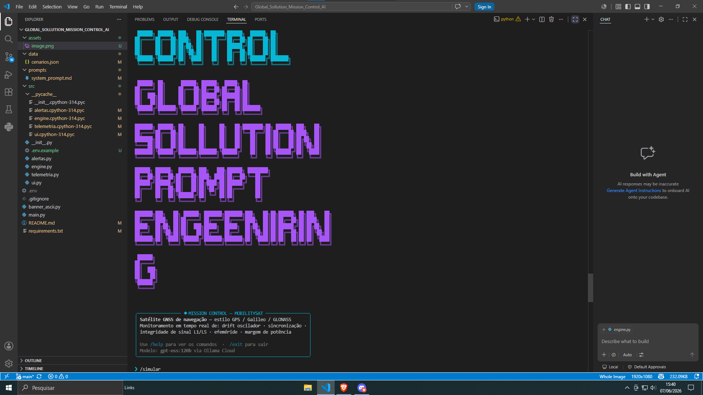
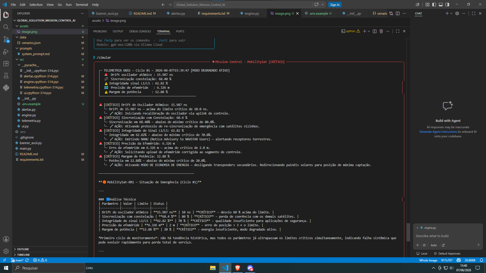

# Mission Control AI — MobilitySat-BR1

> Sistema de monitoramento operacional de satélite GNSS com análise por IA generativa.
> FIAP · Ciência da Computação · Global Solution 2026.1 · Prompt Engineering and AI

---

## Integrantes

| Nome Completo | RM | Turma |
|---|---|---|
| [Guilherme belo] | RM570079 |1CCPJ |
| [André Fujinaga ] | RM569158 |1CCPJ |

**Modalidade:** Dupla

---

## O que o projeto faz

O **MobilitySat-BR1 Mission Control AI** é um sistema de monitoramento operacional que simula a telemetria de um satélite GNSS de navegação (similar a GPS Block III ou Galileo) e usa IA generativa via Ollama Cloud para interpretar os dados em linguagem natural.

A cada ciclo, o sistema coleta 5 parâmetros críticos do satélite, avalia thresholds via lógica Python, dispara alertas automáticos quando necessário, e consulta o modelo `gpt-oss:120b` com o contexto completo da missão para gerar análises contextualizadas. O diferencial é a **memória de contexto** (últimos 5 ciclos) e o **few-shot prompting** que guia o modelo a sempre conectar a análise técnica com o impacto terrestre nas frotas logísticas, agricultura de precisão e veículos autônomos.

---

## Persona atendida

ARIA (Autonomous Response Intelligence for Aerospace) é uma assistente de análise operacional capaz de adaptar suas respostas para três públicos-alvo: Engenheiros de Segmento Espacial, Gestores de Frota Logística e Operadores de Agricultura de Precisão. Além do diagnóstico técnico da missão, a IA traduz os impactos da telemetria para cada contexto de negócio.

---

## Tecnologias utilizadas

- **Python 3.10+**
- **Ollama Cloud API** — modelo `gpt-oss:120b`
- **Rich 15.0.0** — painéis e tabelas no terminal
- **prompt-toolkit 3.0.52** — input editável com histórico
- **PyFiglet 1.0.4** — banner ASCII art
- **python-dotenv 1.0.1** — gerenciamento de credenciais

---

## Como executar

```bash
# 1. Clone o repositório
git clone https://github.com/guilher-cell/mission-control-ai.git
cd mission-control-ai

# 2. Crie e ative o ambiente virtual
python -m venv .venv
source .venv/bin/activate        # Linux / macOS
# .venv\Scripts\activate         # Windows

# 3. Instale as dependências
pip install -r requirements.txt

# 4. Configure as credenciais
cp .env.example .env
# Edite o arquivo .env e insira sua OLLAMA_API_KEY

# 5. Execute o sistema
python main.py
```

---

## Demonstração





---

## Parâmetros monitorados (Trilha MobilitySat)

| Parâmetro | Unidade | Limite Alerta | Limite Crítico |
|---|---|---|---|
| Drift oscilador atômico | ns | > 5 ns | > 10 ns |
| Sincronização com constelação | % | < 95% | < 80% |
| Integridade sinal L1/L5 | % | < 90% | < 70% |
| Precisão da efeméride | m | > 0.8 m | > 2.0 m |
| Margem de potência | % | < 40% | < 20% |

---

## Comandos da CLI

| Comando | Descrição |
|---|---|
| `/status` | Snapshot da telemetria atual sem consultar a IA |
| `/simular` | Força cenário de anomalia crítica para teste |
| `/about` | Informações sobre o projeto e a trilha |
| `/clear` | Limpa o terminal |
| `/help` | Lista todos os comandos |
| `/exit` | Encerra o sistema |
| [qualquer texto] | Pergunta ao motor de análise com IA |

---

## System Prompt (resumo)

O system prompt completo está em [`prompts/system_prompt.md`](prompts/system_prompt.md).

Principais características:
- O contexto completo da missão GNSS brasileira
- **Few-shot prompting** com 2 exemplos anotados (operação normal e crise de potência)
- **Instrução de memória de contexto** — uso do histórico de ciclos para detectar tendências
- **Conexão obrigatória com impacto terrestre** — sempre explica o que a anomalia significa para frotas, agricultura de precisão e veículos autônomos

---

## Cenários de teste demonstrados

1. **Operação normal** — todos os parâmetros dentro dos limites, missão nominal
2. **Crise de potência** — energia em 14%, modo degradado ativo, ação automática de economia
3. **Drift crítico do oscilador** — desvio de 18.5 ns, impacto direto na precisão de frotas
4. **Falha múltipla** — 5 parâmetros críticos simultâneos, plano de ação priorizado pela IA
5. **Tendência de degradação** — memória de contexto detecta piora gradual ao longo dos ciclos

---

## Proposta de valor / Modelo de negócio

### 1. Problema terrestre resolvido

O Brasil movimenta anualmente mais de R$ 1,2 trilhão em logística terrestre, com crescente dependência de sistemas GNSS para rastreamento de frotas, otimização de rotas e agricultura de precisão. Quando um satélite GNSS sofre degradação de sinal, operadores de frota perdem rastreamento confiável, drones de pulverização agrícola ficam fora de operação e veículos autônomos em fase de teste acionam parada de emergência — causando prejuízos que podem chegar a R$ 500 mil por hora de interrupção em operações de grande escala.

O MobilitySat Mission Control AI resolve o gap entre o dado bruto de telemetria orbital e a decisão rápida do engenheiro de missão: em vez de o operador interpretar manualmente planilhas de telemetria, a IA traduz os dados em diagnósticos acionáveis com impacto terrestre explícito em menos de 10 segundos.

### 2. Quem paga pela solução

Modelo híbrido: o segmento espacial (satélite e controle de missão) é financiado por consórcio público-privado (AEB + operadores privados de frota como associações do agronegócio). O sistema de análise por IA é vendido como serviço SaaS para os operadores do NOC das operadoras GNSS privadas brasileiras e para grandes cooperativas agrícolas que precisam de alertas de degradação de sinal em tempo real.

### 3. Métrica de impacto

Se o MobilitySat-BR1 operar com 99,5% de disponibilidade por 1 ano:
- **~85.000 veículos rastreados** com precisão sub-métrica contínua
- **~320.000 hectares de agricultura de precisão** sem interrupção de sinal
- **~2.400 toneladas de defensivos agrícolas** aplicadas com eficiência máxima (redução de sobreposição)
- **Estimativa de R$ 180 milhões** em perdas evitadas por operação ininterrupta de frotas logísticas

### 4. Modelo de negócio

**SaaS + Dado-como-serviço:** assinatura mensal para acesso ao painel de monitoramento de missão com alertas em linguagem natural via IA. Camada premium inclui API de alertas para integração com sistemas ERP de frotas. Receita secundária via venda de relatórios analíticos de disponibilidade de sinal para seguradoras agrícolas que oferecem produtos indexados à qualidade do GNSS.

---

## Limitações conhecidas

- Não suporta múltiplos satélites simultâneos
- Não aprende com ciclos anteriores
- A memória de contexto é limitada a 5 ciclos dentro da mesma sessão — não há persistência entre execuções.
- O sistema não implementa autenticação de operador — qualquer pessoa com acesso ao terminal pode executar comandos.
- O sistema não diferencia perguntas válidas de entradas arbitrárias do usuário. Qualquer texto enviado ao motor de IA resulta em uma análise da missão, mesmo quando a entrada não está relacionada à operação do satélite.
- O sistema utiliza dados simulados e não está conectado a um satélite GNSS real ou a fontes reais de telemetria orbital.
---

##  Vídeo de demonstração

[Assistir demonstração no YouTube]((https://www.youtube.com/watch?v=Dcd2rq6pOc8))


---

## Estrutura do projeto

```
mission-control-ai/
├── README.md
├── main.py
├── banner_ascii.py
├── requirements.txt
├── .env.example
├── .gitignore
├── src/
│   ├── __init__.py
│   ├── ui.py          # Interface CLI (Rich + prompt-toolkit)
│   ├── engine.py      # Motor de análise + integração Ollama
│   ├── telemetria.py  # Geração de dados simulados GNSS
│   └── alertas.py     # Thresholds e lógica de decisão Python
├── prompts/
│   └── system_prompt.md
├── data/
│   └── cenarios.json
└── assets/
    ├── screenshot_banner.png
    └── screenshot_alerta.png
```
